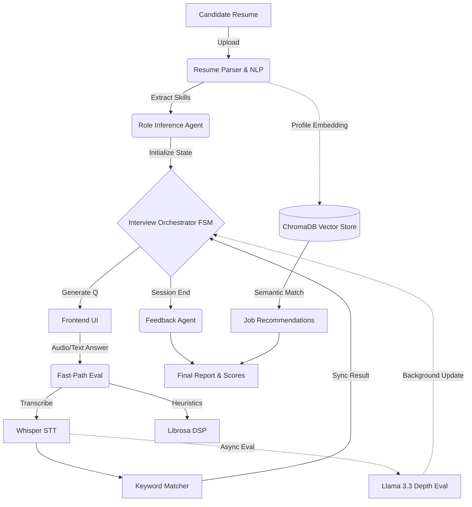

# 🎙️ iphipi — The Intelligent AI Mock Interview Platform


[](https://nextjs.org/)
[](https://fastapi.tiangolo.com/)
[](https://groq.com/)
[](https://opensource.org/licenses/MIT)

**iphipi** is a next-generation, AI-powered mock interview platform designed to provide an ultra-realistic, adaptive interview experience. It goes beyond generic chatbots by parsing your resume, understanding your background, conducting a live audio-interactive interview, and adapting the difficulty of its questions in real-time based on your answers and confidence.

---

## ✨ Key Features

- 📄 **Multimodal Resume Parsing:** Upload a PDF, DOCX, or TXT resume. The system uses `pdfplumber` and `spaCy` NLP to extract your skills, experience, and infer your optimal job role.
- 🧠 **Adaptive FSM Orchestration:** Powered by a Finite State Machine (FSM), the interviewer dynamically adjusts topic and difficulty. If you struggle, it pivots to foundational questions; if you excel, it probes deeper into complex concepts.
- 🗣️ **Real-Time Audio Interactivity:** Speak your answers naturally. Utilizing Groq's `whisper-large-v3-turbo` for lightning-fast speech-to-text, paired with local DSP (`librosa`) to gauge speech rate and hesitation.
- ⚡ **Dual-Eval Scoring Pipeline:** To achieve sub-second conversational latency, answers are immediately evaluated using a synchronous keyword-matching heuristic to drive the conversation forward, while an asynchronous LLM evaluates technical depth in the background.
- 📊 **Multi-Dimensional Coaching:** Receive a comprehensive feedback report scoring you on Technical Correctness, Depth, Communication, Confidence, and Engagement, complete with actionable advice tied to your exact transcript.
- 🎯 **Semantic Job Matching:** Uses local `sentence-transformers` and a ChromaDB vector store to recommend real-world job roles that match your newly assessed skills and resume profile.

---

## 🛠️ Tech Stack

**Frontend:**
- **Framework:** Next.js 16 (App Router) + React 19
- **State Management:** Zustand (for lightweight, global interview state)
- **Styling:** TailwindCSS v4, shadcn/ui, Recharts

**Backend & AI:**
- **API Framework:** FastAPI + Uvicorn + Pydantic
- **LLM Engine:** Groq API (`llama-3.3-70b-versatile` for ultra-low latency reasoning)
- **Speech & Audio:** Groq Whisper (`whisper-large-v3-turbo`) + `librosa`
- **Vector Database:** ChromaDB (Local SQLite-backed)
- **Embeddings:** `sentence-transformers` (`all-MiniLM-L6-v2`)
- **Data Store:** In-memory session tracking with Redis as an optional cache layer
- **Agents:** LangChain + Custom FSM orchestrator

---

## 🏗️ Architecture & Data Flow



---

## 🚀 Quick Start (Local Development)

The platform is designed to run locally with minimal external dependencies. You do not need Docker to spin this up for the hackathon.

### 1. Prerequisites
- Node.js 20+
- Python 3.10+
- A Groq API Key (Get one free at [console.groq.com](https://console.groq.com/))

### 2. Environment Setup
Clone the repository and create a `.env` file in the root:
```bash
git clone https://github.com/ASWD13/AI-mock-interview-tool.git
cd AI-mock-interview-tool
echo "GROQ_API_KEY=your_groq_api_key_here" > .env
```

### 3. Backend Setup
Install Python dependencies and download the required NLP models:
```bash
pip install -r requirements.txt
python -m spacy download en_core_web_sm
```

### 4. Seed the Vector Database
Populate the local ChromaDB with sample interview questions and job recommendations:
```bash
python scripts/seed_jobs.py
python scripts/seed_questions.py
```

### 5. Start the Services
Open two terminal windows.

**Terminal 1 (Backend):**
```bash
uvicorn backend.main:app --reload --port 8001
```

**Terminal 2 (Frontend):**
```bash
cd frontend
npm install
npm run dev
```

Navigate to `http://localhost:3000` to start your mock interview!

---

## 💡 Hackathon Highlights & Talking Points

- **Stateful Orchestration over Chatbots:** Unlike a standard LLM wrapper that forgets context, iphipi maintains a rigid Finite State Machine. It tracks rolling metrics (confidence, technical score, topics visited) to make deterministic decisions about when to escalate difficulty or gracefully shift topics.
- **Latency-Obsessed Design:** Live voice interviews feel unnatural with high latency. We separated evaluation into a "Fast-Path" (keyword extraction + audio heuristics) that unblocks the UI instantly, and a "Slow-Path" (deep LLM analysis) that updates the final score asynchronously. 
- **Multimodal Heuristics:** We don't just judge *what* you say, but *how* you say it. By piping audio through `librosa` before transcription, we measure RMS energy (confidence) and zero-crossing rates (hesitation) to give nuanced behavioral feedback.

*(Note: Advanced computer vision features using MediaPipe and DeepFace are implemented in the `services/vision_analyzer.py` module, but are currently disabled in the synchronous API flow to preserve sub-second response times for the demo.)*

---

## 📄 License
This project is licensed under the MIT License.
